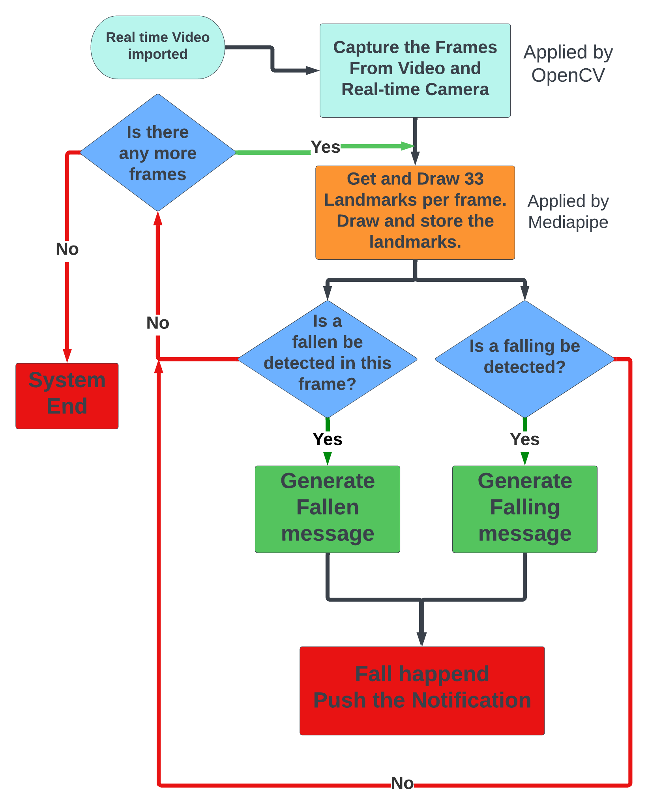
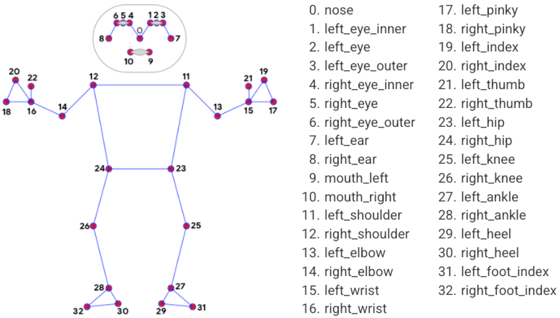
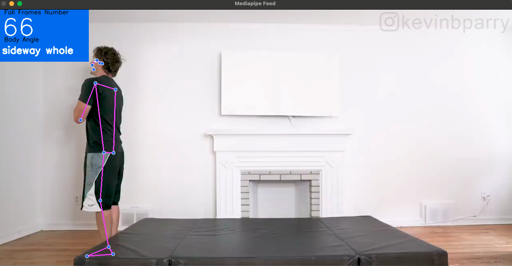
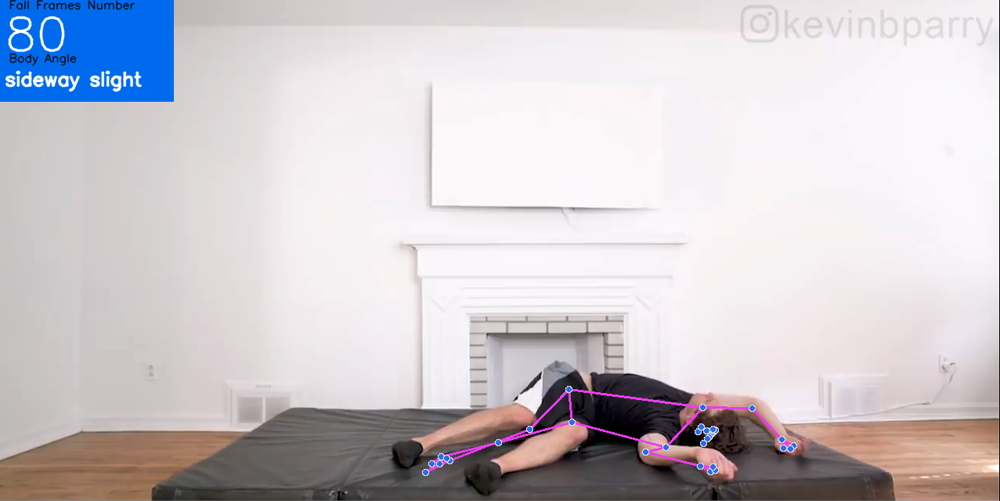
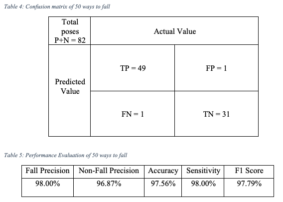
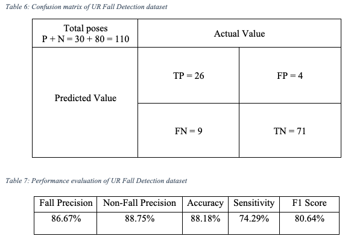

# Fall Detection System

This project utilizes OpenCV and Mediapipe's Pose Estimation capabilities to detect and analyze human postures, thereby determining the occurrence of fall events. The system is designed to monitor in real-time and provide alerts upon detecting falls.

## Features

- Real-time video stream processing and pose detection.
- Uses key points provided by Mediapipe to estimate human postures.
- Detects falling actions and issues alerts upon detection.

## Project Background

With the increase of the aging populatio and their frailty, over **300 thousands**people die every year due to the unintentional falls and over 44% of them happend at home.[1] I was motivated to make this project because I once saw my 76 year old grandmother accidentally fall to the ground and I noticed how difficult it was for her to get up on her own.

## Project Environment

Use this command in the terminal to install all the tools or the packages

```
pip install -r requirements.txt
```

The packages that this project need is shown below:

1. mediapipe
2. opencv-python
3. numpy
4. pushdeer

## Fallen and Falling Detection System Flow chart



For further detail of the algorithm, see the Report inside **Project Overview**

## Results Overview

##### Mediapipe Demonstration

This image shows how mediapipe extracts coordinate points [2]



#### Test for the video

During the testing process, we accumulate the number of frames that determined to a fall

***Before the fall, there are 66 frames determined to fall before this action***



***After the fall, there are 80 frames determined to fall after this action***



***This fall movement creates 14 fall frames***

#### Confusion Matrix for datasets

##### **50 ways to fall [3]**



##### **UR Fall detection data sets [4]**



## How to Contribute

Contributions of code, improvement suggestions, or issue reports are welcome. Please follow these steps:

1. Fork the project.
2. Create a new branch (`git checkout -b feature/AmazingFeature`).
3. Commit your changes (`git commit -m 'Add some AmazingFeature'`).
4. Push to the branch (`git push origin feature/AmazingFeature`).
5. Open a Pull Request.

## Reference

[1] CDC’s STEADI Toolkit. (2018). Unintentional Fall Death Rates, Adults 65+ [Photograph]. Flickr. http://www.cdc.goc/injury/wisqar

[2] Google. (2021, November 19). Google Mediapipe. [Online]. Available: [https://github.com/google/mediapipe](https://github.com/google/mediapipe). [Accessed: Apr. 09, 2023].

[3] "50 ways to fall,"
YouTube video, duration 3:52, posted by Kevin Parry, Oct. 18, 2018. [Online].
Available: [https://www.youtube.com/watch?v=8Rhimam6FgQ](https://www.youtube.com/watch?v=8Rhimam6FgQ). [Accessed: Apr. 10, 2023].

[4] B. Kwolek and M.
Kepski, "Human fall detection on embedded platform using depth maps and
wireless accelerometer," Computer Methods and Programs in Biomedicine,
vol. 117, no. 3, pp. 489-501, Dec. 2014, doi: 10.1016/j.cmpb.2014.08.003.
